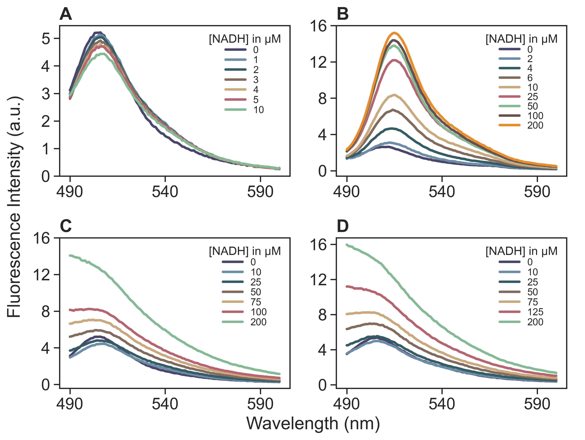

# Fluorescence_Data

The file "functions_spectral_analysis.py" contains all functions for loading and cleaning data. The file "fluorescence titration.py" contains an example of the analysis of steady-state fluroescence data analyzed for the relationship between fluorescence intensity and concentration of the substrate of the investigated protein. The protein in question has two excitation peaks allowing the analysis by two excitation wavelengths (400 and 480 nm), while the emission is always captured in the wavelength window from 490 to 600 nm. The resulting figure is shown below

**A** shows the fluorescence intensity of the protein after excitation at 400 nm in presence of the denoted NADH concentrations (substrate). **B** shows the fluorescence intensity of the protein after excitation at 480 nm. **C** shows the same protein and excitation as **A** just for higher concentrations of the substrate. **D** shows the fluroescence intensity of the substrate itself after excitation at 400 nm.
